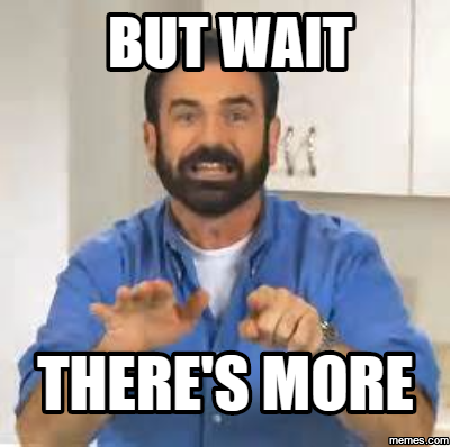

Event-Driven File-Processing Programming Model
==============================================

SCAR supports an event-driven programming model suitable for the execution of highly-parallel file-processing applications that require a customized runtime environment.

The following command::

  cat >> darknet.yaml << EOF
  functions:
    scar-darknet:
      image: grycap/darknet
      memory: 2048
      init_script: examples/darknet/yolo-sample-object-detection.sh
      s3:
        input_bucket: scar-test
  EOF

  scar init -f darknet.yaml

or using the CLI parameters::

  scar init -n scar-darknet -s examples/darknet/yolo-sample-object-detection.sh -es scar-test -i grycap/darknet

Creates a Lambda function to execute the shell-script ``yolo-sample-object-detection.sh`` inside a Docker container created out of the ``grycap/darknet`` Docker image stored in Docker Hub.

The following workflow summarises the programming model, which heavily uses the `convention over configuration <https://en.wikipedia.org/wiki/Convention_over_configuration>`_ pattern:

#) The Amazon S3 bucket ``scar-test`` will be created if it does not exist, and if you don't specify any input folder, a folder with the name of the function ``scar-darknet`` will be created with an ``input`` folder inside it.
#) The Lambda function is triggered upon uploading a file into the ``input`` folder created.
#) The Lambda function retrieves the file from the Amazon S3 bucket and makes it available for the shell-script running inside the container in the ``/tmp/$REQUEST_ID/input`` folder. The ``$SCAR_INPUT_FILE`` environment variable will point to the location of the input file.
#) The shell-script processes the input file and produces the output (either one or multiple files) in the folder ``/tmp/$REQUEST_ID/output``.
#) The output files are automatically uploaded by the Lambda function into the ``output/$REQUEST_ID/`` folder created inside of the ``scar-test/scar-darknet`` path.

Many instances of the Lambda function may run concurrently and independently, depending on the files to be processed in the S3 bucket. Initial executions of the Lambda may require retrieving the Docker image from Docker Hub but this will be cached for subsequent invocations, thus speeding up the execution process.

For further information, examples of such application are included in the `examples/ffmpeg <https://github.com/grycap/scar/tree/master/examples/ffmpeg>`_ folder, in order to run the `FFmpeg <https://ffmpeg.org/>`_ video codification tool, and in the `examples/imagemagick <https://github.com/grycap/scar/tree/master/examples/imagemagick>`_, in order to run the `ImageMagick <https://www.imagemagick.org>`_ image manipulation tool, both on AWS Lambda.

More Event-Driven File-Processing thingies
------------------------------------------

SCAR also supports another way of executing highly-parallel file-processing applications that require a customized runtime environment.

After creating a function with the configuration file defined in the previous section, you can activate the SCAR event launcher using the ``run`` command like this::

  scar run -f darknet.yaml

This command lists the files in the ``scar-darknet/input`` folder of the ``scar-test`` bucket and sends the required events (one per file) to the lambda function.

.. note::  The input path must be previously created and must contain some files in order to launch the functions. The bucket could be previously defined and you don't need to create it with SCAR. If you don't define an specific input folder, make sure the bucket that you use has the following structure: 'bucket/function-name/input'.

The following workflow summarises the programming model, the differences with the main programming model are in bold:

#) **The folder 'scar-darknet/input' inside the amazon S3 bucket 'scar-test' will be searched for files.**
#) **The Lambda function is triggered once for each file found in the 'input' folder. The first execution is of type 'request-response' and the rest are 'asynchronous' (this is done to ensure the caching and accelerate the execution).**
#) The Lambda function retrieves the file from the Amazon S3 bucket and makes it available for the shell-script running inside the container in the ``/tmp/$REQUEST_ID/input`` folder. The ``$SCAR_INPUT_FILE`` environment variable will point to the location of the input file.
#) The shell-script processes the input file and produces the output (either one or multiple files) in the folder ``/tmp/$REQUEST_ID/output``.
#) The output files are automatically uploaded by the Lambda function into the ``output`` folder of ``bucket-name``.

Specific input/output folders
-----------------------------

If you don't like the default folder structure created by SCAR you can specify the input/ouput paths in the configuration file::

  cat >> darknet.yaml << EOF
  functions:
    scar-darknet:
      image: grycap/darknet
      memory: 2048
      init_script: examples/darknet/yolo-sample-object-detection.sh
      s3:
        input_bucket: scar-test-input
        input_folder: my-input-folder
        output_bucket: scar-test-output
        output_folder: my-output-folder
  EOF

  scar init -f darknet.yaml

This configuration file is telling the lambda function to retrieve the input from the bucket ``scar-test-input`` and the folder ``my-input-folder`` and store the outputs in the bucket ``scar-test-output`` and the folder ``my-output-folder/$REQUEST_ID/``. None of this buckets or folders must be previously created for this to work. SCAR manages the creation of the required buckets/folders.

This feature also allows us a workflow by setting the output folder of one function as the input folder of the next function that we want to execute. For example we could have a function that parses a video and stores a keyframe each 10 seconds and then have another function that takes that input and anlyzes it. The configuration files could be something like this::

  cat >> video-parser.yaml << EOF
  functions:
    scar-video:
      image: grycap/ffmpeg
      memory: 1024
      init_script: parse-video.sh
      s3:
        input_bucket: scar-input
        output_folder: video-output
  EOF

  scar init -f video-parser.yaml

  cat >> image-parser.yaml << EOF
  functions:
    scar-darknet:
      image: grycap/darknet
      memory: 2048
      init_script: parse-images.sh
      s3:
        input_bucket: scar-input
        input_folder: video-output
        output_folder: image-output
  EOF

  scar init -f image-parser.yaml  

See how the functions are using the same bucket (although it's not neccesary) and the output folder of the first is the input folder of the second. 

To launch the workflow you only need to upload a video to the folder ``scar-video/input`` of the ``scar-input`` bucket.