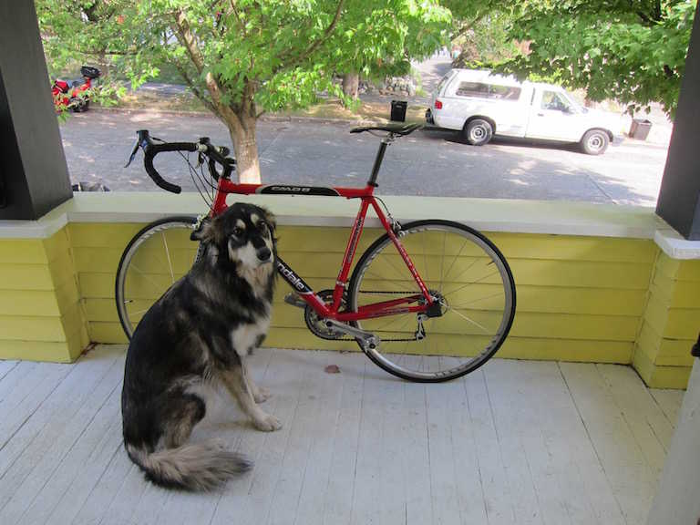

# Running Darknet on AWS Lambda

You can run [Darknet](https://pjreddie.com/darknet) in AWS Lambda via [SCAR](https://github.com/grycap/scar) using the [grycap/darknet](https://hub.docker.com/r/grycap/darknet/) Docker image, based on the [bitnami/minideb:jessie](https://hub.docker.com/r/bitnami/minideb/) one.

[Darknet](https://pjreddie.com/darknet) is an open source neural network framework written in C and CUDA. For the example we will be using the the library 'You only look once' [Yolo](https://pjreddie.com/darknet/yolo/) which is  is a state-of-the-art, real-time object detection system

Since we are using Darknet on the CPU it takes around 6-12 seconds per image, using the GPU version would be much faster.

## Usage in AWS Lambda via SCAR

> WARNING:  To work properly this software needs at least a lambda function with 1024MB of RAM

For the example we are using this image: :

### Event driven invocation (using S3)

You can run a container out of this image on AWS Lambda via [SCAR](https://github.com/grycap/scar) using the following procedure:

Create the Lambda function using the `scar-darknet.yaml` configuration file:

```sh
scar init -f scar-darknet.yaml
```

Launch the Lambda function uploading a file to the `s3://scar-darknet/scar-darknet-s3/input` folder in S3.

```sh
scar put -b scar-darknet/scar-darknet-s3/input -p dog.jpg
```

Take into consideration than the first invocation will take considerably longer than the subsequent ones, where the container will be cached.

To check the progress of the function invocation you can call the `log` command:
```sh
scar log -f scar-darknet.yaml
```

### HTTP invocation (using API Gateway)

The same can be achieved by defining an HTTP endpoint with the AWS API Gateway and invoking the function using a POST request.

We start by creating the Lambda function and linking it to and API endpoint:

```sh
scar init -f scar-darknet-api-s3.yaml
```

Launch the Lambda function using the `invoke` command of SCAR (due to the 29 timeout of the API endpoint, it's very probable that the first execution gives you an `Error (Gateway Timeout): Endpoint request timed out` although if you check the logs the lambda function should have finished correctly):

```sh
scar invoke -f scar-darknet-api-s3.yaml -db dog.jpg
```

To avoid the api timeout you can launch the function asynchronously:

```sh
scar invoke -f scar-darknet-api-s3.yaml -db dog.jpg -a
```

> WARNING: Check the [AWS lambda limits](https://docs.aws.amazon.com/lambda/latest/dg/limits.html) to know the maximum size of files that can be send as payload of the POST request

### Processing the S3 output

When the execution of the function finishes, the script used produces two output files and SCAR copies them to the S3 bucket used. To check if the files are created and copied correctly you can use the command:

```sh
scar ls -b scar-darknet/scar-darknet-api/output
```

Which outputs:
```
scar-darknet-api/output/68f5c9d5-5826-44gr-basc-8f8b23f44cdf/image-result.png
scar-darknet-api/output/68f5c9d5-5826-44gr-basc-8f8b23f44cdf/result.out
```

The files are created in the output folder following the `s3://$BUCKET_NAME/$FUNCTION_NAME/output/$REQUEST_ID/*.*` structure.


To download the created files you can also use SCAR. Download a folder with:

```sh
scar get -b scar-darknet/scar-darknet-api/output -p /tmp/lambda/
```

This command creates the `scar-darknet-api/ouput` folder and all the required subfolders in the `/tmp/lambda/` folder

In our case the two output files are result.out:

```sh
/tmp/68f5c9d5-5826-44gr-basc-8f8b23f44cdf/input/dog.jpg: Predicted in 12.383388 seconds.
dog: 82%
truck: 64%
bicycle: 85%
```

and image-result.png:


Don't forget to delete the function when you finish your testing:

```sh
scar rm -f scar-darknet-api-s3.yaml
```

Have in mind that the bucket and the folders and files created are not deleted when the function is deleted.

If you want to delete the bucket you have to do it manually.

### Processing the output locally

Other option when invoking a synchronous function is to store the output in our machine.

When using this option you have to make sure that the output generated by your script is the binary content that you want to save in your machine. Also due to the API Gateway limits your function has to finish in 30 seconds or less.

The script `scar-darknet-api-bin.yaml` process the image using darknet, packages the image output and the darknet output, and then dumps the packaged file in the standard output.

SCAR reads the output binary content and then creates the file in the specified file by the CLI command:

```sh
scar init -f scar-darknet-api-bin.yaml
scar invoke -f scar-darknet-api-bin.yaml -db dog.jpg -o output.tar.gz
```

By using this functionality the user can process the function output without using S3 buckets.