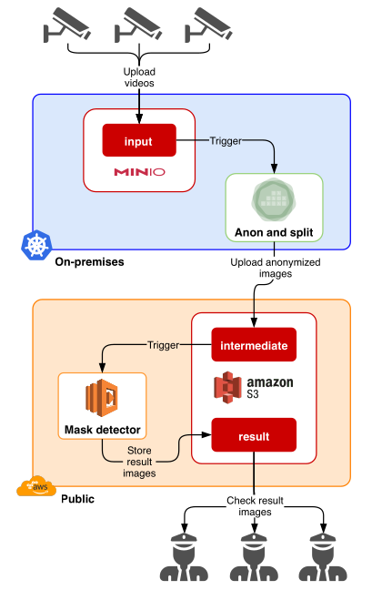
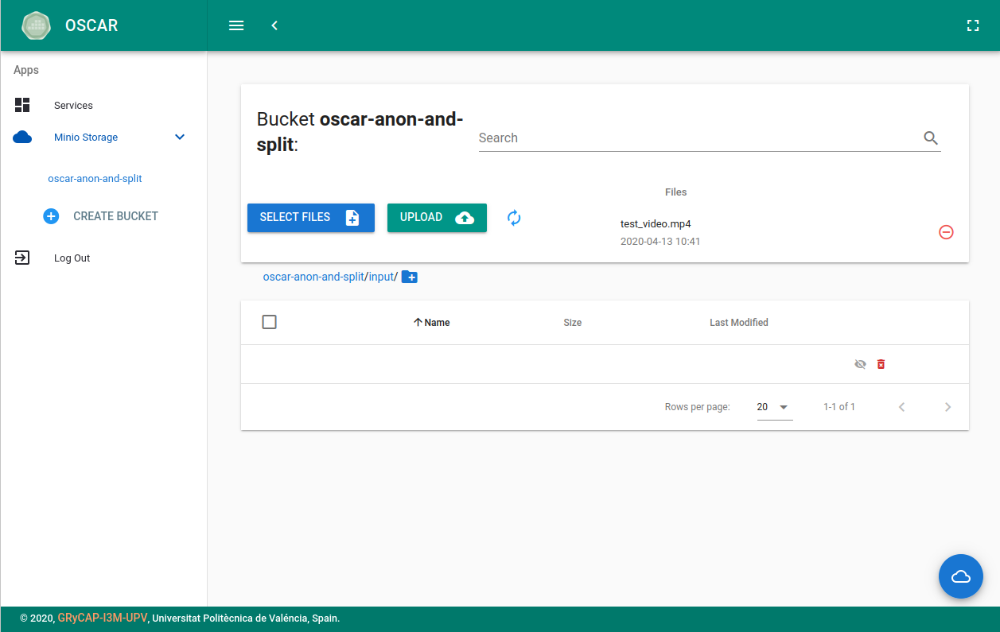
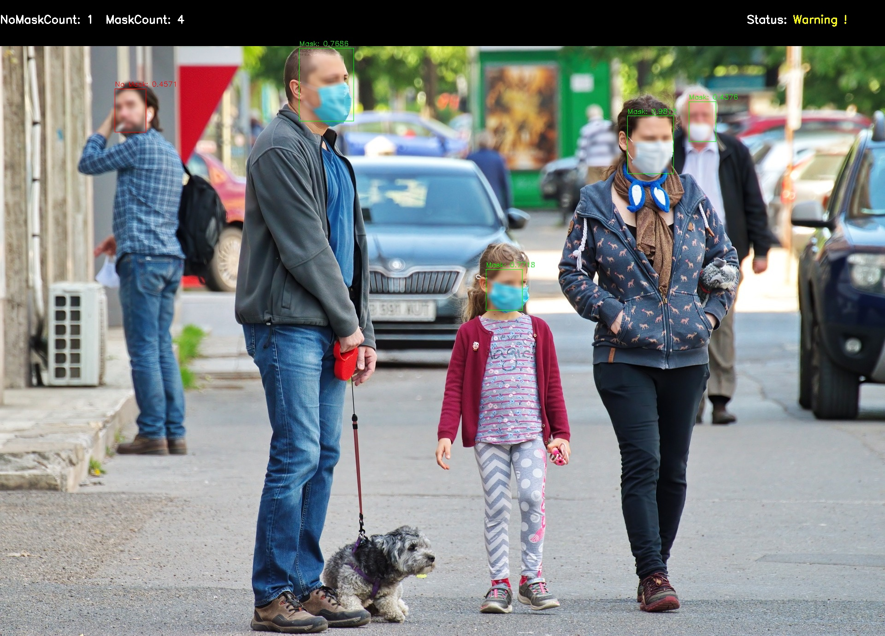

# Mask detector hybrid workflow

This example deploys a hybrid workflow to process anonymised video frames in order to recognize people wearing masks.

The workflow is composed by the "Anon and split" function, based on [BlurryFaces](https://github.com/asmaamirkhan/BlurryFaces), which extracts a frame every 5 seconds of video and blur the faces of the picture. Notice that this function runs on top of an [OSCAR](https://github.com/grycap/oscar) cluster, which can be deployed on on-premises clouds to ensure data regulation compliance.

Anonymised pictures will be uploaded to the intermediate Amazon S3 bucket, which triggers the "Mask detector" function. This function performs face mask detection using a [custom](https://github.com/adityap27/face-mask-detector) deep learning model based on [YOLOv3](https://pjreddie.com/darknet/yolo/) running on AWS Lambda.



Both functions are defined in the `scar-mask-detector-workflow.yaml` file.

## Building the containers

You can use our pre-built docker containers available on [Docker Hub](https://hub.docker.com/u/grycap) as indicated in the functions definition file.

If you want to build the containers by yourself, you first need to download the pre-trained models for both functions and copy them into the `blurry-faces` and `mask-detector` folders. You can download the BlurryFaces model for the "Anon and split" function [here](https://grycap.s3.amazonaws.com/datasets/scar/blurry-faces/face.pb) and the custom YOLOv3 model for the "Mask detector" function [here](https://grycap.s3.amazonaws.com/datasets/scar/mask-detector/yolov3-tiny_obj_train_tiny8.weights).

## OSCAR configuration

In order to create the "Anon and split" function you need to deploy an OSCAR cluster. You can do it [locally using kind](https://grycap.github.io/oscar/local-testing/), [on top of IaaS platforms](https://grycap.github.io/oscar/deploy-ec3/) with [EC3](https://github.com/grycap/ec3) or on [any Kubernetes cluster](https://grycap.github.io/oscar/deploy-helm/) using our [helm chart](https://github.com/grycap/helm-charts/tree/master/oscar).

Once the OSCAR cluster is properly deployed you must configure SCAR with the OSCAR's endpoint and credentials for allowing communication with its [API](https://grycap.github.io/oscar/api/). To do it you only have to edit the `~/.scar/scar.cfg` file:

```
{
  ...

  "oscar": {
    "my_oscar": {   // IDENTIFIER OF THE CLUSTER (MUST MATCH WITH THE FUNCTIONS DEFINITION FILE)
      "endpoint": "https://<OSCAR_ENDPOINT>",
      "auth_user": "<OSCAR_USERNAME>",
      "auth_password": "<OSCAR_PASSWORD>",
      "ssl_verify": false,  // ENABLE SSL CERTS VERIFICATION
      "memory": "256Mi",    // DEFAULT MEMORY FOR FUNCTIONS
      "cpu": "0.2",         // DEFAULT CPU FOR FUNCTIONS
      "log_level": "INFO"   // DEFAULT LOG LEVEL FOR FUNCTIONS
    }
  }

  ...
}
```

## Create the processing functions

To create the workflow you must add your AWS credentials for the S3 bucket in the `scar-mask-detector-workflow.yaml` file and execute the following command:

```sh
scar init -f scar-mask-detector-workflow.yaml
```

After that, you can list the functions by running:

```sh
scar ls

AWS FUNCTIONS:
NAME                          MEMORY    TIME  IMAGE_ID                          API_URL    SUPERVISOR_VERSION
--------------------------  --------  ------  --------------------------------  ---------  --------------------
scar-mask-detector              1024     300  grycap/mask-detector-yolo:mini    -          1.3.1

OSCAR SERVICES - CLUSTER "my_oscar" (https://oscar.endpoint):
NAME                  MEMORY      CPU  IMAGE_ID
--------------------  --------  -----  -------------------
oscar-anon-and-split  2Gi           1  grycap/blurry-faces

```

## Launch the execution

In order to launch an execution you only have to upload a video to the defined *input* folder of the "oscar-anon-and-split" MinIO bucket. You can do it through the [OSCAR web interface](https://grycap.github.io/oscar/usage/#login), the MinIO browser or using the [MinIO Client](https://docs.min.io/docs/minio-client-complete-guide.html).



## Process the output

When the execution of the workflow finishes, the resulting output files are uploaded to the *result* folder of the `scar-mask-detector` S3 bucket. To check if the files are properly created you can access to the Amazon S3 console or use the command:

```sh
scar ls -b scar-mask-detector/result
```

Which lists the following outputs:

```
result/test_video/img1.jpg
result/test_video/img10.jpg
result/test_video/img2.jpg
result/test_video/img3.jpg
result/test_video/img4.jpg
result/test_video/img5.jpg
result/test_video/img6.jpg
result/test_video/img7.jpg
result/test_video/img8.jpg
result/test_video/img9.jpg

...
```

The files are created in the output folder following the `s3://scar-mask-detector/result/<INPUT_FILE_NAME>/imgXX.jpg` structure.

To download the generated files you can also use SCAR with the following command:

```sh
scar get -b scar-mask-detector/result -p /tmp/mask-detector/
```

This command creates the `mask-detector` folder in the `/tmp` path, in which the resulting pictures of every input video can be displayed.



## Delete the functions

Do not forget to delete the functions when you finish your testing:

```sh
scar rm -f scar-mask-detector-workflow.yaml
```

Have in mind that the S3 and MinIO buckets, folders and files created are not deleted when the functions are removed.
